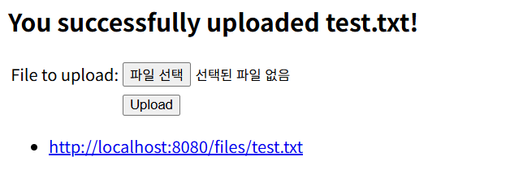
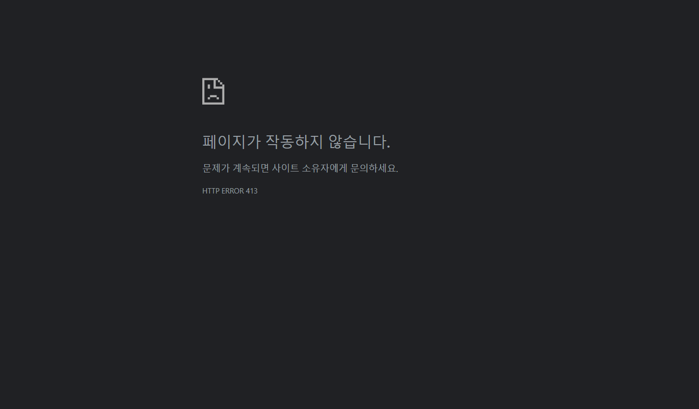

# Spring Guides: Uploading Files

## 1. 만든 것
* **개념**
    * Spring Boot, Spring MVC, Thymeleaf를 활용
    * 클라이언트로부터 멀티파트(`multipart/form-data`) 파일 업로드 요청을 받아 서버의 파일 시스템에 저장하고, 저장된 파일의 목록 조회 및 다운로드를 제공하는 SSR 웹 서비스 구축

* **주요 기능**
    * `/` 경로로 HTTP GET 요청 시, 업로드된 파일의 다운로드 URL 목록과 파일 업로드 폼 화면(`uploadForm.html`) 반환
    * 파일 제출 시 유효성 검증 후 서버 디스크에 저장 및 플래시 메시지와 함께 메인 화면으로 리다이렉트
    * `/files/{filename:.+}` 경로 접속 시, 저장소의 해당 파일을 `Resource` 객체로 로드하여 브라우저 다운로드
    * 애플리케이션 구동 시 기존 업로드 폴더를 초기화

---
## 2. 주요 기술 및 문법 (주요 메서드, 파라미터 및 개념 상세)

### 1) `MvcUriComponentsBuilder`와 동적 URL 생성 (빌더 패턴)
* **`storageService.loadAll()`**: 저장소 폴더 내의 모든 파일 경로 목록을 `Stream<Path>` 형태로 반환
* **`FileUploadController.class`**: 해당 클래스의 메타데이터를 담은 `Class` 객체, `MvcUriComponentsBuilder`가 컨트롤러에 정의된 매핑 정보를 읽어와 URL을 조합하기 위해 전달
* **`MvcUriComponentsBuilder.fromMethodName(...)`**: 컨트롤러 정보와 메서드명을 기반으로 URL을 동적 생성
    * **파라미터**
      * `Class<?> controllerType`(대상 컨트롤러 클래스)
      * `String methodName`(호출할 컨트롤러 내 메서드명)
      * `Object... args`(대상 메서드의 파라미터에 들어갈 실제 값)
* **빌더 패턴 체이닝 구조**:
    1. **`fromMethodName(...)`**: 컨트롤러와 메서드 정보를 조합하여 URL 생성 도구(Builder) 구성
    2. **`.build()`**: 전달받은 파라미터(파일명)를 `{filename}` 위치에 치환하여 완성된 URI 구성요소 객체 생성
    3. **`.toUri()`**: 스프링 전용 객체(`UriComponents`)를 자바 표준 네트워크 객체(`java.net.URI`)로 변환
    4. **`.toString()`**: HTML 및 Model에서 사용 가능하도록 URI 객체 내부 주소값을 문자열로 변환
* **전체 흐름**: `loadAll()`로 파일 경로 탐색 $\rightarrow$ `fromMethodName()`으로 `serveFile` 메서드 매핑 경로 탐색 $\rightarrow$ `build().toUri().toString()`을 거쳐 완성된 다운로드 URL로 변환 $\rightarrow$ `collect(Collectors.toList())`로 묶어 Model에 담고 HTML로 전달

### 2) URL 경로 매핑 정규표현식 `{filename:.+}`
* **스프링 MVC 기본 설정**: URL 경로 끝의 점(`.`) 뒤에 오는 확장자를 잘라내는 특성이 있음
* **`{filename:.+}`**: 파일명 뒤의 확장자 점(`.`)까지 잘리지 않고 전체 파일명으로 인식되도록 지정
    * **`:`**: 구분자로, 앞의 변수명(`filename`)에 뒤쪽 정규표현식을 적용하겠다는 의미
    * **`.`**: 줄바꿈 문자를 제외한 임의의 문자 1개
    * **`+`**: 앞의 패턴(`.`)이 최소 1개 이상 연속해서 반복됨을 의미

### 3) HTTP 헤더 및 응답 제어
* **`CONTENT_DISPOSITION` 헤더**: 브라우저에게 응답받은 데이터를 어떻게 처리할지 지시하는 HTTP 표준 헤더
    * **`inline`**: 기본값, 브라우저가 화면에 직접 띄움 (이미지 웹 렌더링 등)
    * **`attachment`**: 브라우저가 파일 다운로드 창을 띄우도록 강제 (`attachment; filename="..."`)
* **`ResponseEntity<Resource>`**:
    * **`ResponseEntity`**: HTTP 응답의 상태 코드(Status), 헤더(Header), 바디(Body)를 개발자가 직접 제어하는 스프링 클래스
    * **`Resource`**: 파일 데이터(바이너리)를 스프링에서 추상화하여 다루는 인터페이스 (`org.springframework.core.io.Resource`)
* **`RedirectAttributes` & `addFlashAttribute()`**:
    * 리다이렉트(`redirect:`) 실행 시 다른 페이지로 데이터를 1회성으로 전달하는 스프링 MVC 객체
    * `addFlashAttribute()`: 데이터를 URL 쿼리 파라미터에 노출하지 않고 서버 세션에 임시 저장 후 리다이렉트된 화면에 넘김

### 4) Java NIO 및 파일 시스템 제어
* **`Path`**: 자바 NIO(`java.nio.file`)에서 파일이나 디렉토리 경로를 다루는 인터페이스
* **`normalize()`**: 경로 문자열 내의 `.`(현재 디렉토리)이나 `..`(상위 디렉토리) 같은 상대 경로 기호를 계산하여 정돈(정규화)
* **`toAbsolutePath()`**: 상대 경로(`"upload-dir/photo.jpg"`)를 서버 디스크의 최상위 루트 디렉토리부터 시작하는 완전한 절대 경로로 변환
* **`resolve()`**: 경로 결합(연결) 메서드
* **`getParent()`**: 파일의 전체 경로에서 파일명을 제외하고 파일이 위치한 부모 폴더의 경로만 추출
* **`equals(...)`**: 두 경로가 문자열 및 위치상으로 완전히 일치하는지 비교하여 디렉토리 이탈(Path Traversal) 검증 수행
* **`Files.copy(inputStream, destinationFile, StandardCopyOption.REPLACE_EXISTING)`**:
    * 입력 스트림의 데이터를 목적지 경로(`destinationFile`)로 복사
    * `REPLACE_EXISTING`: 동일한 이름의 파일이 이미 존재하는 경우 덮어쓰기 수행
* **`Files.walk(path, maxDepth)`**:
    * 해당 경로를 타고 들어가며 모든 파일/폴더를 탐색
    * `maxDepth = 1`로 지정하여 하위 폴더 깊숙이 들어가지 않고 지정한 폴더 바로 아래의 파일들만 1단계 스캔

### 5) 스프링 부트 애플리케이션 초기화 및 테스트 문법
* **`CommandLineRunner`**: 스프링 부트 애플리케이션이 구동 완료된 후 자동으로 실행할 초기화 작업(`deleteAll()`, `init()`)이 있을 때 사용하는 특수 인터페이스
* **`@AutoConfigureMockMvc` & `MockMvc`**: 실제 웹 서버를 띄우지 않고 가짜 MVC 환경(`MockMvc`)을 구성하여 HTTP GET/POST 요청 및 응답을 고속으로 검증
* **`@MockitoBean`**: 스프링 컨테이너 내의 가짜 `StorageService` 객체(Mock)를 주입받아 테스트 목적으로 활용
* **BDD 테스트 구문**:
    * **Given (`given(...)`)**: `storageService.loadAll()` 호출 시 가짜 `Stream`을 리턴하도록 시뮬레이션
    * **When & Then (`mvc.perform(...)`)**: GET/POST 요청을 보냈을 때 상태 코드 및 모델, 헤더 검증
    * **Then (`then(...).should()`)**: `storageService.store(...)` 메서드가 실제 실행되었는지 행위 검증

---
## 3. 핵심 Annotation & 인터페이스 요약
| Annotation / Interface | 설명 |
|:---|:---|
| **`@EnableConfigurationProperties`** | `@ConfigurationProperties("storage")`가 달린 `StorageProperties` 클래스를 스프링 컨테이너의 빈(Bean)으로 공식 등록 |
| **`@ConfigurationProperties("storage")`** | 외부 설정 파일(`application.properties`)에서 접두사가 `"storage"`인 외부 설정값들을 자바 객체 필드로 자동 바인딩 |
| **`MultipartFile`** | 스프링이 제공하는 업로드 파일 데이터(바이너리, 파일명, 크기 등) 인터페이스 - `getOriginalFilename()`: 원본 파일명 - `getSize()`: 파일 용량(Byte) - `isEmpty()`: 비어있는지 여부 - `getInputStream()`: 파일 읽기용 입력 스트림 |
| **`@RequestParam("file")`** | HTML `<form>`의 `name="file"` 속성으로 전송된 `MultipartFile` 바이너리 데이터를 자바 변수로 매핑 |
| **`@ResponseBody`** | 컨트롤러 반환값을 HTML 템플릿으로 처리하지 않고, HTTP Response Body에 바이너리 데이터/텍스트 그대로 직접 출력 |
| **`@ExceptionHandler`** | 컨트롤러 내부에서 지정한 예외(`StorageFileNotFoundException`)가 발생했을 때 이를 가로채서 커스텀 응답 처리 |
| **`ResponseEntity<?>`** | 제네릭 와일드카드(`<?>`)를 사용하여 바디 데이터 타입이 정해지지 않았음을 의미 (예: 404 Not Found 반환 시 바디 없이 상태 코드만 전달) |
| **`@AutoConfigureMockMvc`** | 실제 웹 서버를 띄우지 않고 가짜 MVC 환경(`MockMvc`)을 자동으로 구성 |
| **`@MockitoBean`** | 스프링 컨테이너 안의 특정 빈을 가짜 Mock 객체로 대체하여 주입 |

---
## 4. 발생한 문제
### 1) Java Resource 타입 Mismatch 및 404/500 에러
* **원인**
    * 잘못된 import 구문(`jakarta.annotation.Resource`) 사용으로 스프링 파일 처리 인터페이스인 `org.springframework.core.io.Resource`와 타입 충돌 및 `.exists()` 메서드 참조 불가 발생
    * 상대 경로로 이미 정제된 `Path` 객체에 대해 `path.getFileName()`을 중복 호출하여 URL 조합 경로가 꼬여 리다이렉트 시 404 에러 발생
* **해결**
    * `import org.springframework.core.io.Resource;`로 수정
    * `path.getFileName().toString()` 대신 `path.toString()`으로 변경하여 순수 파일명이 정상적으로 URL에 인코딩되도록 수정

### 2) HTTP ERROR 413 (Payload Too Large)
* **원인**
    * `application.properties`에 `spring.servlet.multipart.max-file-size=128KB` 제한 설정으로 인해 용량이 큰 파일을 올렸을 때 서버 측 차단 발생
* **해결**
    * 128KB 이하의 테스트용 파일(`test.txt`) 사용 혹은 `application.properties`의 업로드 용량 제한을 넉넉하게 변경(`10MB`)하여 해결

---
## 5. 실행화면
### 1) Standard 기본 입력 화면 및 파일 업로드 성공 (GET / & POST /)

### 2) 용량 초과 차단 화면 (HTTP ERROR 413)
